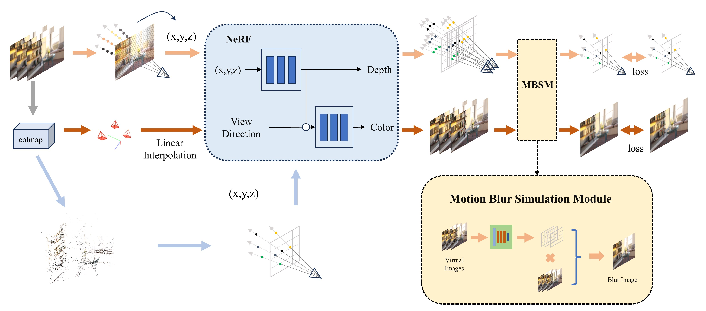
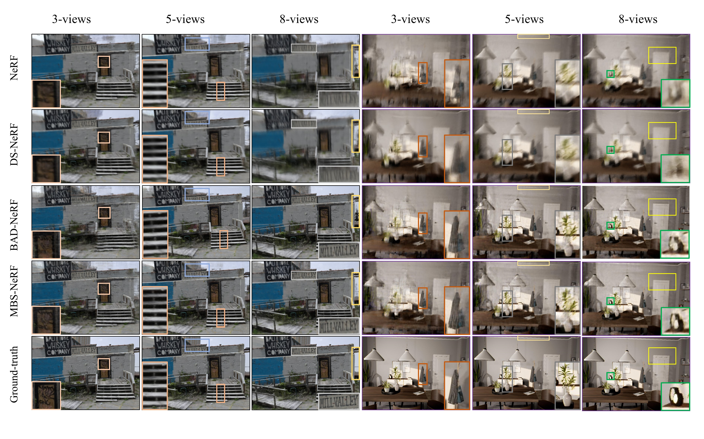
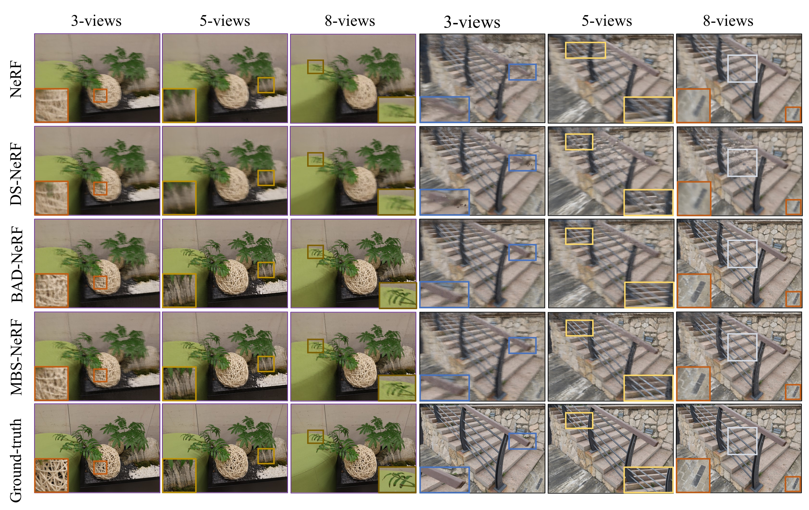

# MBS-NeRF: Reconstruction of Sharp Neural Radiance Fields from Motion-Blurred Sparse Images
 

## Installation
Clone this repository
```
git clone https://github.com/bo1230/MBS-NeRF.git
cd MBS-NeRF
```

The code is tested with Python3.10, PyTorch==2.1.2+cu118 and cudatoolkit=11.8. To create a conda environment:
```
conda create –n MBS-NeRF python=3.10
conda activate MBS-NeRF
conda install pytorch==2.1.2 torchvision==0.16.2 torchaudio==2.1.2 pytorch-cuda=11.8 -c pytorch -c nvidia
```
For different platforms, the pytorch installation will probably be different.

## Datasets

You can download all the data in [Deblur-NeRF](https://github.com/limacv/Deblur-NeRF) and [BAD-NeRF](https://github.com/WU-CVGL/BAD-NeRF).

## Training
Training with synthetic datasets
```
python train.py --config configs/cozy2room_3v_depth.txt
```
## Result
### Synthesized dataset

### Real dataset:


### RGB and Depth Video:

https://github.com/user-attachments/assets/baa0d723-328f-4201-a5f4-eb1323f27948

https://github.com/user-attachments/assets/d4db4ca1-86bf-4318-9fef-7ad7dab66f0f

